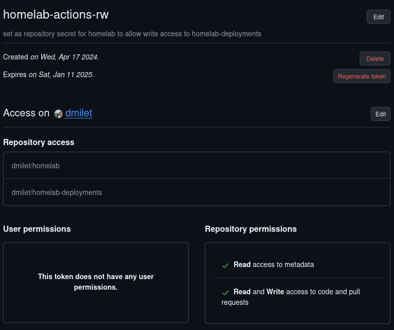
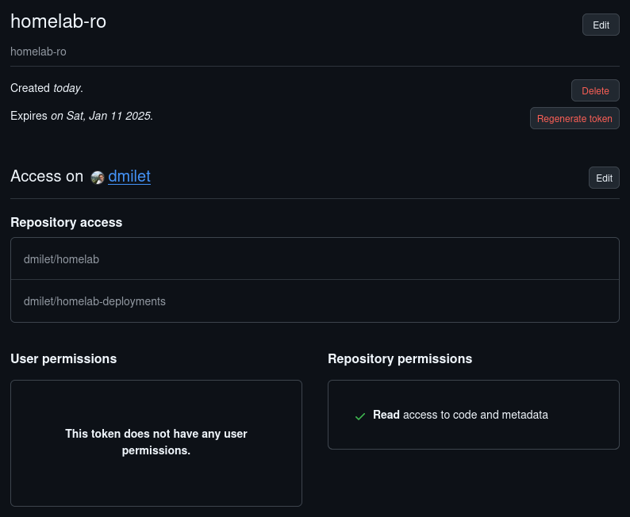
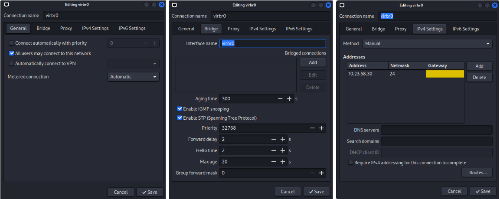
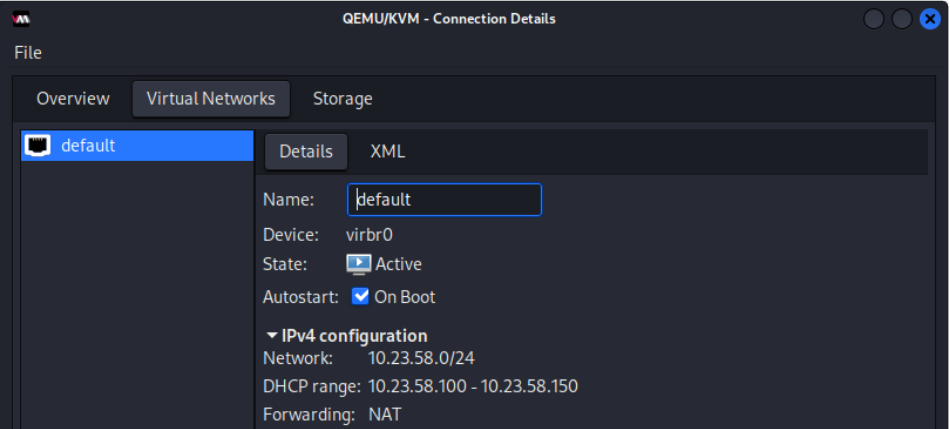
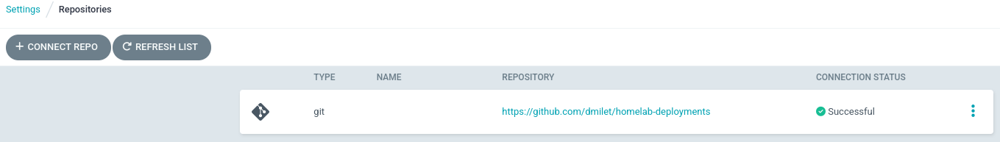
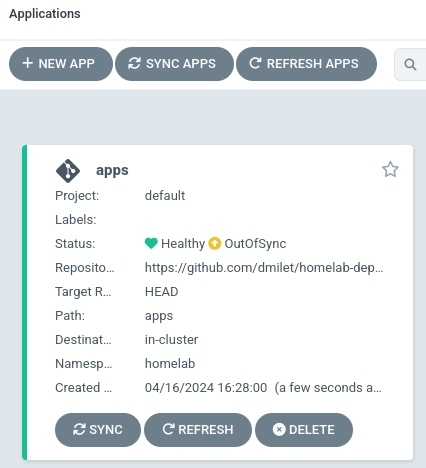
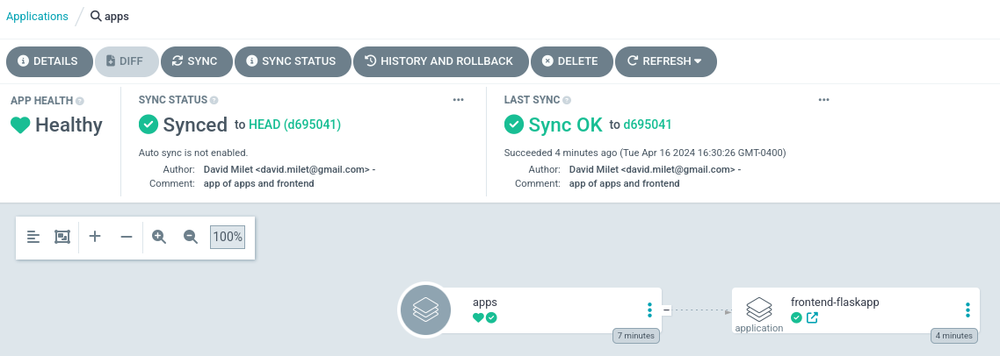
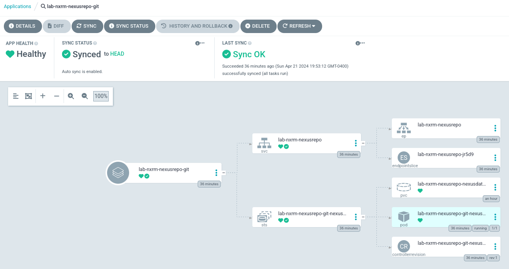

# Home Lab Setup
## GitHub 

### Personal Access Tokens
https://github.com/settings/tokens?type=beta





## WSL Ubuntu
### Fix WSL Ubuntu to support python virtual environments
```
sudo apt-get update
sudo apt-get install libpython3-dev
sudo apt-get install python3-venv
```
Reference: [Installing venv for python3 in WSL (Ubuntu)](https://stackoverflow.com/questions/61528500/installing-venv-for-python3-in-wsl-ubuntu)

### install docker
```
 sudo apt install docker.io
```

### install net-tools
```
sudo apt install net-tools
```

## Linux Laptop

Configure Virtual Bridge virbr0
```
3: virbr0: <NO-CARRIER,BROADCAST,MULTICAST,UP> mtu 1500 qdisc noqueue state DOWN group default qlen 1000
    link/ether 52:54:00:b8:e9:81 brd ff:ff:ff:ff:ff:ff
    inet 10.23.58.30/24 brd 10.23.58.255 scope global virbr0
       valid_lft forever preferred_lft forever
```


### MicroK8s
Date: 2024-03-17
#### Network Bridge (virbr0) 


#### Create Disk
```console
sudo -iu root
cd /var/lib/libvirt/images
qemu-img create -f qcow2 umksn1.qcow2 20G
qemu-img create -f qcow2 umksn1-pvc.qcow2 20G
chown libvirt-qemu:libvirt-qemu umksn1.qcow2
chown libvirt-qemu:libvirt-qemu umksn1-pvc.qcow2

ls -l umksn1.qcow2
-rw-r--r-- 1 libvirt-qemu libvirt-qemu      196928 Mar 17 13:43 umksn1.qcow2
ls -l umksn1-pvc.qcow2
-rw-r--r-- 1 libvirt-qemu libvirt-qemu 196928 Apr 19 11:32 umksn1-pvc.qcow2
```

#### Install Ubuntu Server
[Ubuntu Server 22.04.4 LTS ISO media](https://releases.ubuntu.com/jammy/ubuntu-22.04.4-live-server-amd64.iso)

| Item | Value |
| ---- | --------------------- | 
| Name | Ubuntu-MicroK8S-Node1 |
| OS   | [Ubuntu Server 22.04.4 LTS ISO media](https://releases.ubuntu.com/jammy/ubuntu-22.04.4-live-server-amd64.iso) | 
| RAM  | 8 GB |
| CPU  | 4    |
| Disk1 | 20GB. Attach umksn1.qcow2 disk (see above) |
| Disk2 | 20GB. Attach umksn1-pvc.qcow2 disk (see above) |
| Network | virbr0 | 


Note: to attach disk device, create XML file like
```
<disk type="file" device="disk">
  <driver name="qemu" type="qcow2"/>
  <source file="/var/lib/libvirt/images/umksn1-pvc.qcow2"/>
  <target dev="vdb" bus="virtio"/>
</disk>
```
Then, attach to VM
```
virsh attach-device --config Ubuntu-MicroK8S-Node1 vdb.xml
```

Install OpenSSH server

Install MicroK8s snap

After reboot
```
sudo apt upgrade
sudo apt install net-tools
```

Connect to console, and check assigned IP address
```
david@umksn1:~$ ip addr | head -n 10
1: lo: <LOOPBACK,UP,LOWER_UP> mtu 65536 qdisc noqueue state UNKNOWN group default qlen 1000
    link/loopback 00:00:00:00:00:00 brd 00:00:00:00:00:00
    inet 127.0.0.1/8 scope host lo
       valid_lft forever preferred_lft forever
    inet6 ::1/128 scope host 
       valid_lft forever preferred_lft forever
2: enp1s0: <BROADCAST,MULTICAST,UP,LOWER_UP> mtu 1500 qdisc fq_codel state UP group default qlen 1000
    link/ether 52:54:00:c3:31:c4 brd ff:ff:ff:ff:ff:ff
    inet 10.23.58.134/24 metric 100 brd 10.23.58.255 scope global dynamic enp1s0
       valid_lft 2040sec preferred_lft 2040sec

```

Add entry to /etc/hosts on Host (Linux Laptop)
```
└─# tail -n 2 /etc/hosts

10.23.58.134 umksn1
```

From Host, install own ssh public key to Ubuntu Server VM
```
└─$ ssh-copy-id -i ~/.ssh/id_rsa david@umksn1
/usr/bin/ssh-copy-id: INFO: Source of key(s) to be installed: "/home/david/.ssh/id_rsa.pub"                                                              
/usr/bin/ssh-copy-id: INFO: attempting to log in with the new key(s), to filter out any that are already installed                                       
/usr/bin/ssh-copy-id: INFO: 1 key(s) remain to be installed -- if you are prompted now it is to install the new keys                                     
david@umksn1's password:                                                                                                                                 
                                                                                                                                                         
Number of key(s) added: 1                                                                                                                                
                                                                                                                                                         
Now try logging into the machine, with:   "ssh 'david@umksn1'"                                                                                           
and check to make sure that only the key(s) you wanted were added.                                             
```

Create VG on /dev/vdb for the persistent storage
```
pvcreate /dev/vdb
vgcreate pvc-vg /dev/vdb
vgs
  VG        #PV #LV #SN Attr   VSize   VFree
  pvc-vg      1   0   0 wz--n- <20.00g <20.00g
  ubuntu-vg   1   1   0 wz--n-  18.22g  20.00m

mkdir /pvc
lvcreate -n pvc-lv -l 5119 /dev/pvc-vg
mkfs.xfs /dev/pvc-vg/pvc-lv
echo "/dev/pvc-vg/pvc-lv /pvc xfs defaults" >> /etc/fstab
mount -a
chmod 777 /pvc
```


#### MicroK8s installation
[MicroK8s](https://microk8s.io/docs/getting-started)
In the Ubuntu Server Guest VM
```
sudo usermod -a -G microk8s $USER
sudo chown -R $USER ~/.kube
sudo mkdir -p ~/.kube
newgrp microk8s
sudo reboot
```


Upgrade MicroK8s
```
sudo snap refresh microk8s --channel 1.31
```

Enable add-ons
```
microk8s enable hostpath-storage
microk8s enable ingress
microk8s enable dashboard
```

Check status
```
david@umksn1:~$ microk8s status
microk8s is running
high-availability: no
  datastore master nodes: 127.0.0.1:19001
  datastore standby nodes: none
addons:
  enabled:
	dashboard        	# (core) The Kubernetes dashboard
	dns              	# (core) CoreDNS
	ha-cluster       	# (core) Configure high availability on the current node
	helm             	# (core) Helm - the package manager for Kubernetes
	helm3            	# (core) Helm 3 - the package manager for Kubernetes
	hostpath-storage 	# (core) Storage class; allocates storage from host directory
	ingress          	# (core) Ingress controller for external access
	metrics-server   	# (core) K8s Metrics Server for API access to service metrics
	storage          	# (core) Alias to hostpath-storage add-on, deprecated
  disabled:
	cert-manager     	# (core) Cloud native certificate management
	cis-hardening    	# (core) Apply CIS K8s hardening
	community        	# (core) The community addons repository
	gpu              	# (core) Automatic enablement of Nvidia CUDA
	host-access      	# (core) Allow Pods connecting to Host services smoothly
	kube-ovn         	# (core) An advanced network fabric for Kubernetes
	mayastor         	# (core) OpenEBS MayaStor
	metallb          	# (core) Loadbalancer for your Kubernetes cluster
	minio            	# (core) MinIO object storage
	observability    	# (core) A lightweight observability stack for logs, traces and metrics
	prometheus       	# (core) Prometheus operator for monitoring and logging
	rbac             	# (core) Role-Based Access Control for authorisation
	registry         	# (core) Private image registry exposed on localhost:32000
	rook-ceph        	# (core) Distributed Ceph storage using Rook
```

Add kubectl alias
```
echo alias kubectl=\"microk8s kubectl\" >> ~/.profile
```

Log off and log back in
```
$ kubectl get namespaces
NAME          	STATUS   AGE
default       	Active   9h
ingress       	Active   8h
kube-node-lease   Active   9h
kube-public   	Active   9h
kube-system   	Active   9h
```

Install KUBECONFIG file in MicroK8s VM
```
mkdir -p ~/.kube
microk8s config > ~/.kube/config
```

Install KUBECONFIG file in Host Linux Laptop.
```
mkdir -p ~/.kube
scp david@umksn1:/home/david/.kube/config ~/.kube/config
chmod 600 ~/.kube/config


┌──(david㉿kali-PF37QNB7)-[~]
└─$ kubectl auth whoami
ATTRIBUTE   VALUE
Username	admin
Groups  	[system:masters system:authenticated]
```

Create namespaces
```
kubectl create ns dev
kubectl create ns prod
kubectl create ns nxrm
kubectl create ns postgres
kubectl create ns hashivault
```

Create Secret to Docker Hub
```
kubectl create secret generic dockerhub -n dev --from-file=.dockerconfigjson=/home/david/.docker/config.json --type=kubernetes.io/dockerconfigjson
kubectl create secret generic dockerhub -n prod --from-file=.dockerconfigjson=/home/david/.docker/config.json --type=kubernetes.io/dockerconfigjson
```

Create Storage Class for PVC, under 
```
cat configs/microk8s/microk8s-custom-hostpath-pvc.yaml
kind: StorageClass
apiVersion: storage.k8s.io/v1
metadata:
  name: microk8s-custom-hostpath-pvc
provisioner: microk8s.io/hostpath
reclaimPolicy: Delete
parameters:
  pvDir: /pvc
volumeBindingMode: WaitForFirstConsumer


kubectl apply -f microk8s-custom-hostpath-pvc.taml

kubectl get sc
NAME                           PROVISIONER            RECLAIMPOLICY   VOLUMEBINDINGMODE      ALLOWVOLUMEEXPANSION   AGE
microk8s-custom-hostpath-pvc   microk8s.io/hostpath   Delete          WaitForFirstConsumer   false                  45s
microk8s-hostpath (default)    microk8s.io/hostpath   Delete          WaitForFirstConsumer   false                  32d 
```
Reference: (https://microk8s.io/docs/addon-hostpath-storage)

Configure port forwarding for Dashboard on port 10443 (HTTPS)
```
kubectl port-forward -n kube-system service/kubernetes-dashboard 10443:443
```

Retrieve token to login to dashboard (https://localhost:10443)

```
kubectl -n kube-system describe secret microk8s-dashboard-token
```


### ArgoCD
Date: 2024-03-18

Check helm version on Host
```
└─$ helm version
version.BuildInfo{Version:"v3.14+unreleased", GitCommit:"", GitTreeState:"", GoVersion:"go1.21.6"}
```

Add ArgoCD Helm Repo
```
helm repo add argo-cd https://argoproj.github.io/argo-helm
helm repo update
```

Search latest version of argo-cd helm chart
```
helm search repo argo-cd
```

Edit chart version in charts/argo-cd/Chart.yaml. Keep chart version and dependency version aligned for clarity
```
version: 7.6.8
dependencies:
  - name: argo-cd
    version: 7.6.8   # most recent tag as of 10/13/24
    repository: https://argoproj.github.io/argo-helm
```

Update dependency for argo-cd chart. This will create Chart.lock file with references to upstream chart.
```
helm dep update charts/argo-cd/
```

Install ArgoCD
```
kubectl create ns argocd
helm install -n argocd argo-cd charts/argo-cd
```

Or upgrade ArgoCD
```
helm upgrade -n argocd argo-cd charts/argo-cd
# if needed, sometimes server is missing some auto-generated secret key
kubectl rollout restart -n argocd deploy/argo-cd-argocd-server
```

Install ArgoCD Triggers and Templates
```
kubectl apply -n argocd -f https://raw.githubusercontent.com/argoproj/argo-cd/stable/notifications_catalog/install.yaml
kubectl get cm -n argocd
```

Retrieve ArgoCD admin password
```
┌──(david㉿kali-PF37QNB7)-[~/.kube]
└─$ kubectl get secret -n argocd argocd-initial-admin-secret -o jsonpath="{.data.password}" | base64 -d
```

Configure port forwarding for ArgoCD on port 8080 (HTTP)
```
┌──(david㉿kali-PF37QNB7)-[~/.kube]
└─$ kubectl port-forward -n argocd svc/argo-cd-argocd-server 8080:80
Forwarding from 127.0.0.1:8080 -> 8080
Forwarding from [::1]:8080 -> 8080
```

Configure repository
in `homelab/configs/argocd/argocd-repositories.yaml`, add the current GitHub personal token (https://github.com/settings/tokens?type=beta)
Then, apply with
```
kubectl apply -n argocd -f argocd-repositories.yaml
```




Configure project (from `homelab/configs/argocd/argocd-projects.yaml`)
```
kubectl apply -n argocd -f argocd-projects.yaml
```


Install argocd command line
```
curl -sSL -o argocd-linux-amd64 https://github.com/argoproj/argo-cd/releases/latest/download/argocd-linux-amd64
sudo install -m 555 argocd-linux-amd64 /usr/local/bin/argocd
rm argocd-linux-amd64
```
Reference: [CLI installation](https://argo-cd.readthedocs.io/en/stable/cli_installation/)

Deploy App or Apps
```
└─$ argocd login localhost:8080
WARNING: server is not configured with TLS. Proceed (y/n)?            
Username: admin
Password:                                                                      
'admin:login' logged in successfully                                                                                                                                                                                                        
Context 'localhost:8080' updated                                                                        

argocd app create dev \
    --project default \
    --dest-namespace argocd \
    --dest-server https://kubernetes.default.svc \
    --repo https://github.com/dmilet/homelab-deployments.git \
    --path app-of-apps/dev \
    --directory-recurse
argocd app create prod \
    --project default \
    --dest-namespace argocd \
    --dest-server https://kubernetes.default.svc \
    --repo https://github.com/dmilet/homelab-deployments.git \
    --path app-of-apps/prod

argocd app create lab \
    --project default \
    --dest-namespace argocd \
    --dest-server https://kubernetes.default.svc \
    --repo https://github.com/dmilet/homelab-deployments.git \
    --path app-of-apps/lab
```




```
└─$ argocd app sync lap
TIMESTAMP                  GROUP              KIND    NAMESPACE                  NAME    STATUS    HEALTH        HOOK  MESSAGE
2024-04-16T16:30:25-04:00  argoproj.io  Application     homelab     frontend-flaskapp  OutOfSync  Missing
2024-04-16T16:30:26-04:00  argoproj.io  Application     homelab     frontend-flaskapp  OutOfSync  Missing              application.argoproj.io/frontend-flaskapp created
2024-04-16T16:30:26-04:00  argoproj.io  Application     homelab     frontend-flaskapp    Synced  Missing              application.argoproj.io/frontend-flaskapp created

Name:               default/homelabapps
Project:            default
Server:             https://kubernetes.default.svc
Namespace:          homelab
URL:                https://argocd.example.com/applications/homelabapps
Repo:               https://github.com/dmilet/homelab-deployments.git
Target:                                                                                                                                                                         
Path:               app-of-apps                                        
SyncWindow:         Sync Allowed                                   
Sync Policy:        <none>                                        
Sync Status:        Synced to  (d695041)                             
Health Status:      Healthy                                        

Operation:          Sync                                        
Sync Revision:      d695041efd83e355d7ad2c4c172a183afd6b9647                                        
Phase:              Succeeded                                        
Start:              2024-04-16 16:30:25 -0400 EDT              
Finished:           2024-04-16 16:30:26 -0400 EDT              
Duration:           1s                                        
Message:            successfully synced (all tasks run)         

GROUP        KIND         NAMESPACE  NAME               STATUS  HEALTH  HOOK  MESSAGE
argoproj.io  Application  homelab    frontend-flaskapp  Synced                application.argoproj.io/frontend-flaskapp created
```



Sync individual apps
```
argocd app sync -l argocd.argoproj.io/instance=homelabapps
```


### Postgres
In `postgres` namespace, create secret with postgres user password to be use by helm chart for the initialization of the database
```
kubectl create secret generic -n postgres lab-postgres-passwords  --from-literal=postgres=xxx
```

Now sync the lab/postgres app from ArgoCD

### Nexus repository Manager
Nexus Repository Manager Helm chart only supports HA config and Postgres which requires PRO licence.
For this lab setup, we use our own Helm Chart.
Make sure that the nexusrepo application is deployed successfully in the LAB project




Then execute shell into the nexus repo pod:
```
kubectl exec -it -n nxrm lab-nxrm-nexusrepo-git-nexusrepo-0 /bin/sh

mv /nexus-data/etc/nexus.properties /nexus-data/etc/nexus.properties.orig
ln -s /nexus-configs/nexus.properties nexus.properties
```

Next, kill the pod to get it restarted
```
kubectl delete pod -n nxrm lab-nxrm-nexusrepo-git-nexusrepo-0
```

Finally 
```
kubectl port-forward -n nxrm  svc/lab-nxrm-nexusrepo 8443:8443
kubectl port-forward -n nxrm  svc/lab-nxrm-nexusrepo 8444:8444
```


# Updates
## 2024-12-04 - error: unsupported configuration: Security driver model 'apparmor' is not available
```
└─# virsh start Ubuntu-MicroK8S-Node1
error: Failed to start domain 'Ubuntu-MicroK8S-Node1'
error: unsupported configuration: Security driver model 'apparmor' is not available
```

Fix:
```
virsh save-image-edit /var/lib/libvirt/qemu/save/Ubuntu-MicroK8S-Node1.save
```

Remove apparmor line at the end.

Then
```
virsh start Ubuntu-MicroK8S-Node1
```